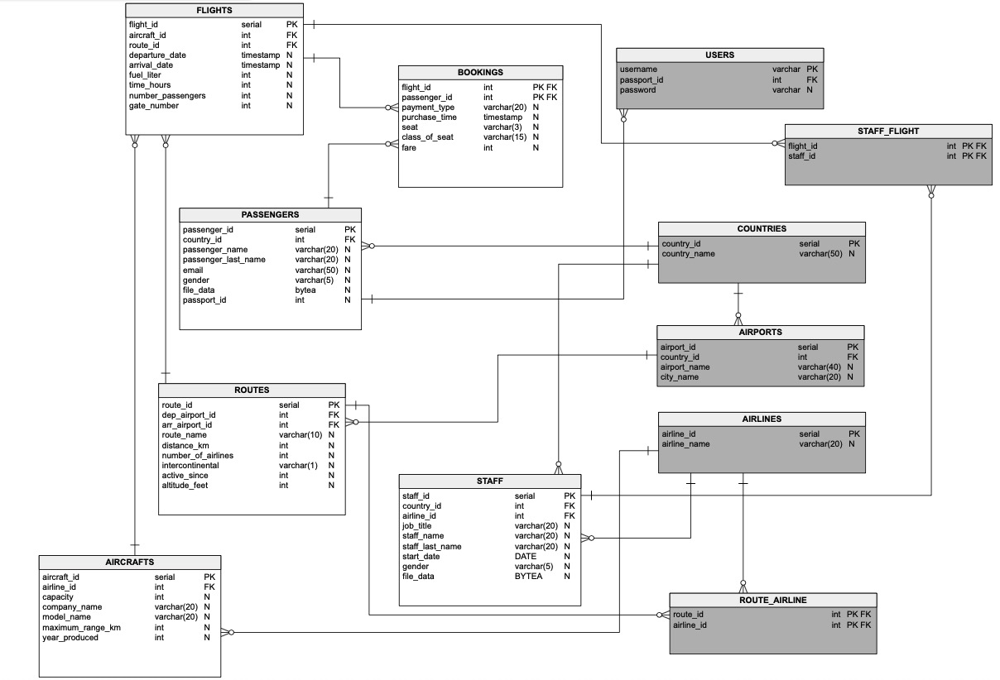

Developer Guide
===============

Database Design
---------------

Here is the database diagram. There are 6 main tables and 6 extra tables. Each main table has at least 5 non key elements.

**Main tables: Passengers, Flights, Routes, Bookings, Staff and Aircrafts**
**Extra tables: Countries,  Airlines,  Airports, Route-Airline, Staff-Flight, Users**

**Main Tables** 

Every passenger has a unique passenger id and passport id. Passenger id is related to tables, passport id is more like real id. Country id represents passenger’s nation (connects to COUNTRIES table). Passport id is also a non key. Other non keys are about other specifications of passengers: 
*Name, last name, email, gender, photograph*

Every flight has a unique flight id. A flight has a route and aircraft: route id and aircraft id (connects to ROUTES table and AIRCRAFTS table). Non keys are used to define other specifics: 
*Departure and arrival date, consumed fuel, duration of the flight, number of passengers*

Each route has unique route id. Departure and arrival airports are important for a route: departure/arrival airport id (connects to AIRPORTS table). Non keys are: 
*route name, distance, number of airlines using the route*
*Intercontinental: Does the route end up in a different continent?*
*Active since which year? e.g. China related routes appearing later than other routes*
*Altitude information is about the required height the planes should fly at*

Flight id and passenger id are sufficient to represent primary key together (connects to FLIGHTS table and PASSENGERS table). Non keys are features of a receipt/booking:
*Payment type, exact purchasing time, seat number, class of the seat, and fare*

Each staff has staff id. Nation of the staff and employer airline are represented as country id and airline id (connects to COUNTRIES table and AIRLINES table). Non keys are about other specifics of the staff:
*Job title, name, last name, start date of employement, gender, and photograph*

Each aircraft has its id. Airlines who own the aircrafts are represented as airline id (connects to AIRLINES table). Non keys are:
*capacity, manufacturer name, model name, maximum flight range, year produced*

**Extra Tables**

Countries table contains list of countries that are used throughout the website/Project
Airlines table contains information about airlines that main/roof company have
Airports table contains name, city name, country id of airports
Route-Airline table contains information about which airline uses which route
Staff-Flight table contains which staff is assigned to which flight
Users table contains users of the website

.. toctree::

   Ahmed
   Bulut

