Admin
================================

Admin Login
--------

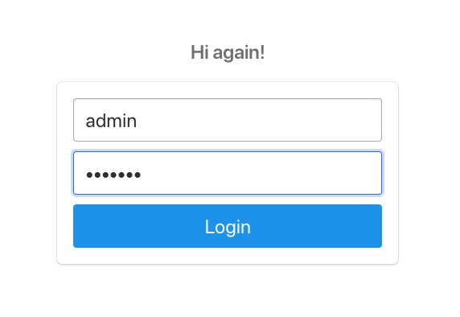

This is how admin logs in.

Admin Page
--------

.. figure:: photos/admin/admin_page.jpg

    
Admin's page. All the options admin has. 

Intermediate Page of Selecting Tables for Operations
--------

.. figure:: photos/admin/table_selecting.jpg

    
After clicking options (add, delete, update, view) this page shows up and admin selects the table to implement the option he has just chosen. 

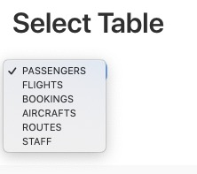

These are the names of the tables. Admin can only change main tables.

Option 1: Add
--------

Add an aircraft. These are the necessary info that website asks from admin so that a new aircraft can be added to the database.

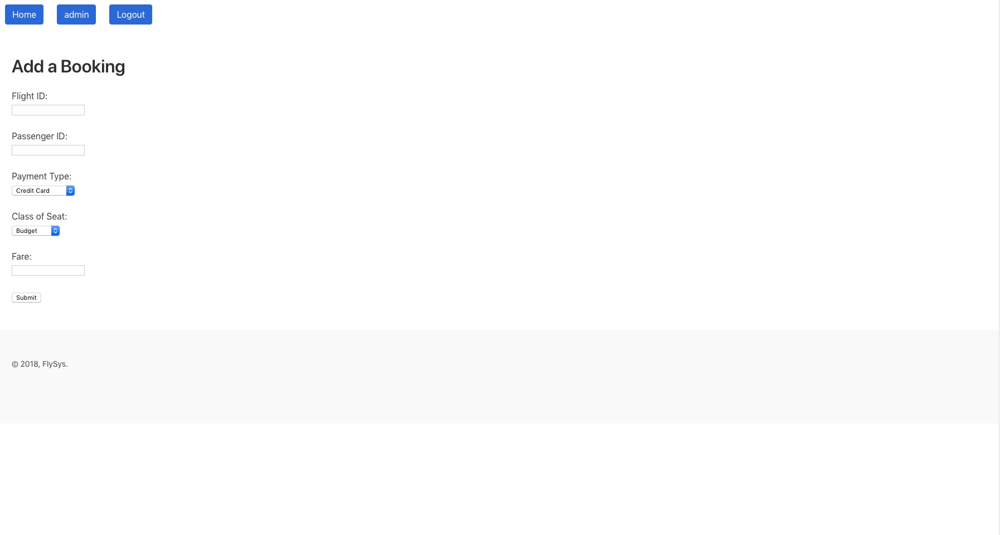

Add a booking. These are the necessary info that website asks from admin so that a new booking can be added to the database.

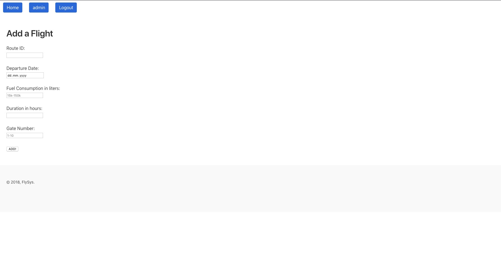

Add an flight. These are the necessary info that website asks from admin so that a new flight can be added to the database.

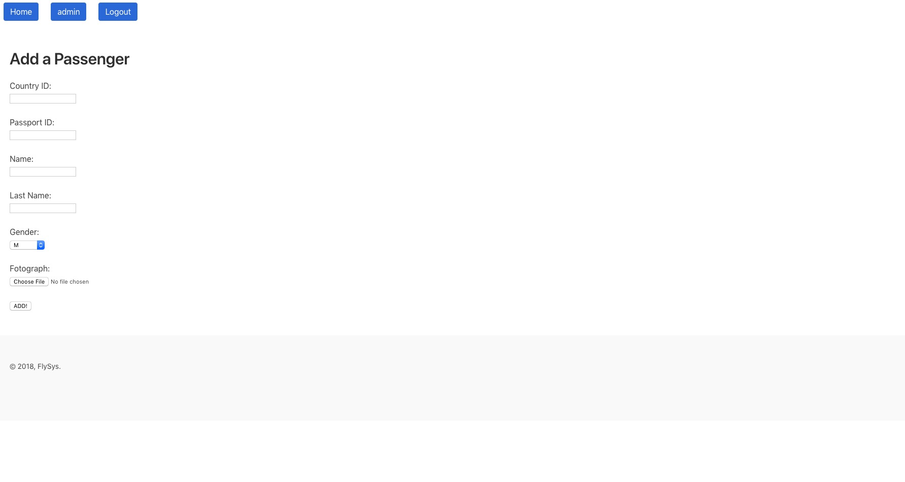

Add a passenger. These are the necessary info that website asks from admin so that a new passenger can be added to the database.

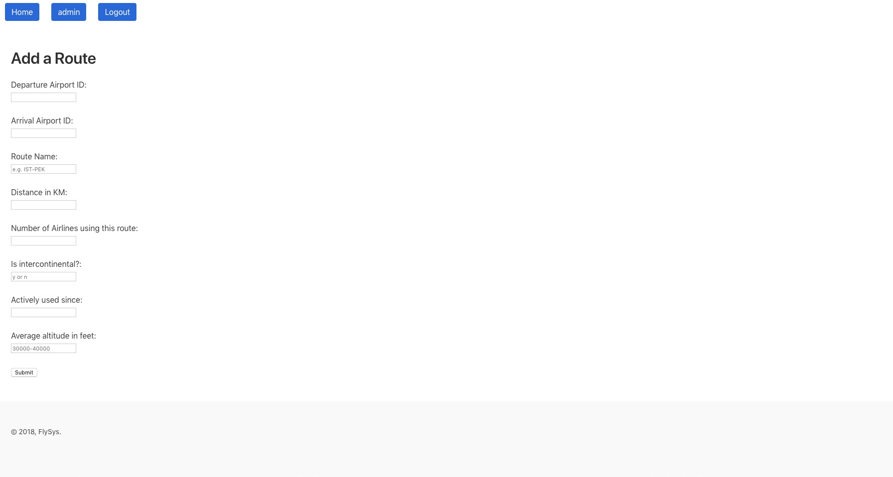

Add a route. These are the necessary info that website asks from admin so that a new route can be added to the database.

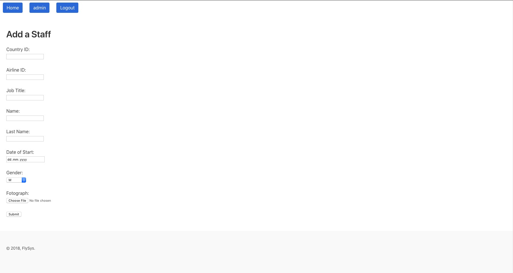

Add a staff. These are the necessary info that website asks from admin so that a new staff can be added to the database.

Option 2: Delete
--------

Here, website only asks necessary id information to delete a booking/flight/passenger/route/aircraft/staff from the database. More complicated delete combination (since there are hundreds) can be handled from the 5th option which is entering direct sql query. 

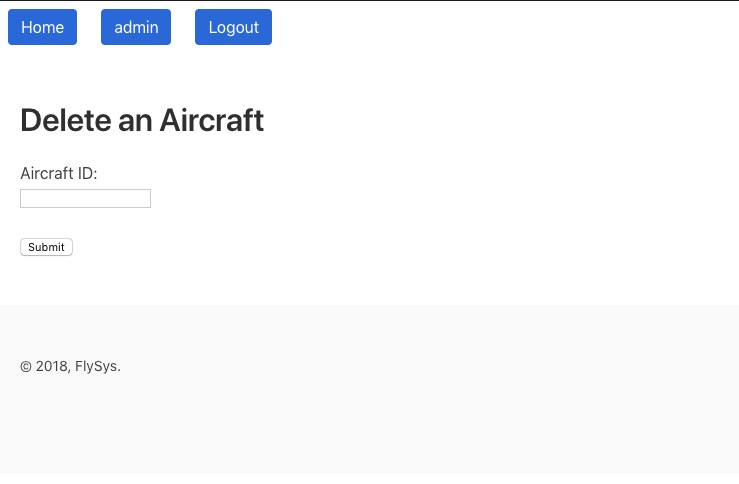

Delete an aircraft. This is the necessary info that website asks from admin so that a new aircraft can be deleted to the database. Only aircraft_id is necessary. 

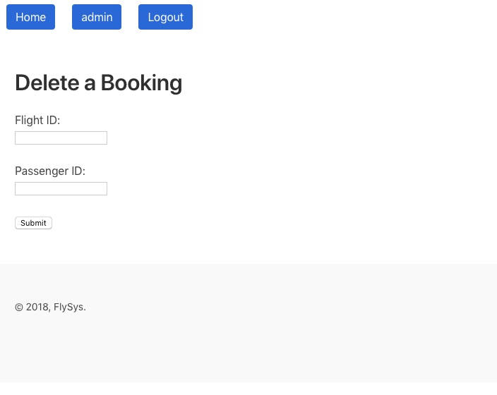

Delete a booking. These are the necessary info that website asks from admin so that a new booking can be deleted to the database. Only passenger_id and flight_id are necessary. 

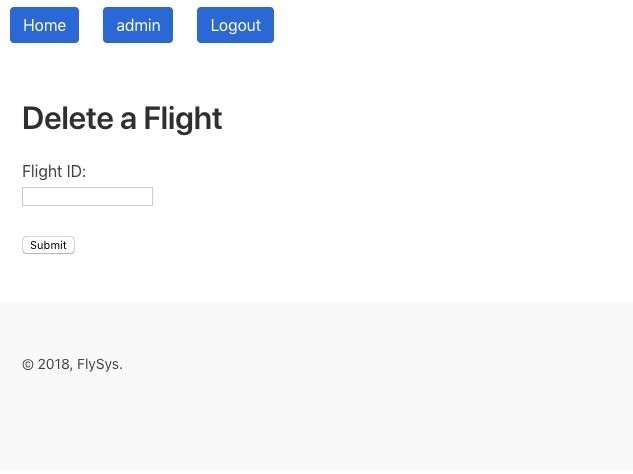

Delete a flight. This is the necessary info that website asks from admin so that a new flight can be deleted to the database. Only flight_id is necessary. 

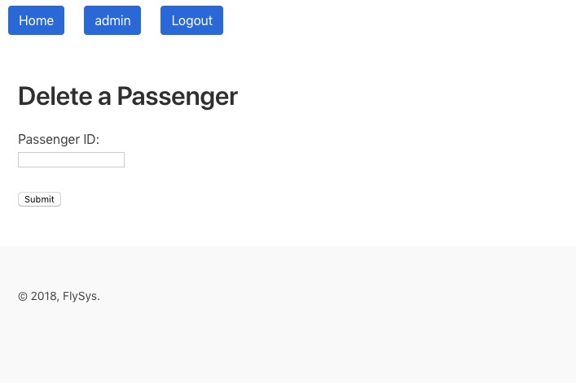

Delete a passenger. This is the necessary info that website asks from admin so that a new passenger can be deleted to the database. Only passenger_id is necessary. 

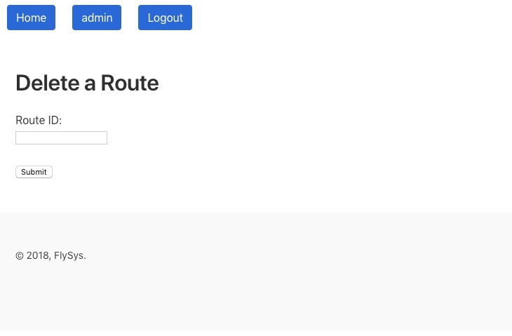

Delete a route. This is the necessary info that website asks from admin so that a new route can be deleted to the database. Only route_id is necessary. 

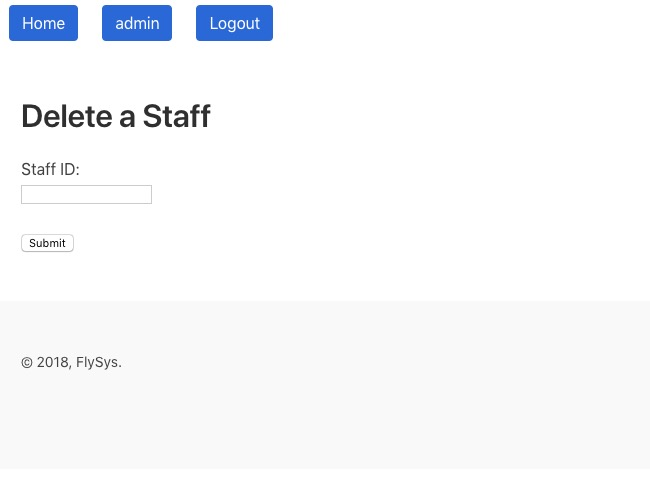

Delete a staff. This is the necessary info that website asks from admin so that a new staff can be deleted to the database. Only staff_id is necessary. 

Option 3: Update
--------

Here, website asks information regarding to what is going to be updated. Only filled forms are executed in the update operation. Empty forms are considered as they are not going to change.

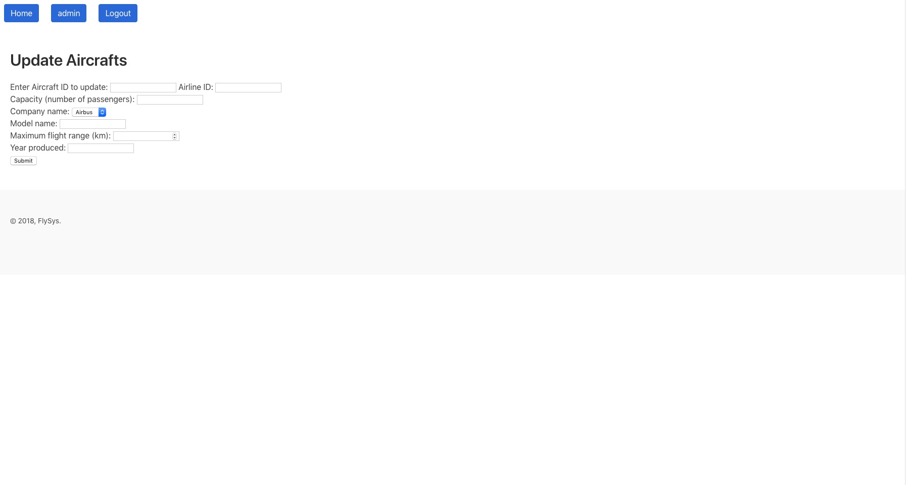

Update an aircraft. Admin fills out what is needed to change in the Aircrafts table. 

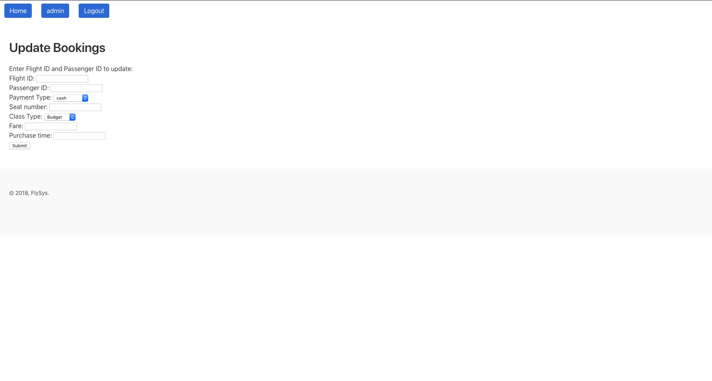

Update a booking. Admin fills out what is needed to change in the Bookings table. 

Update an flight. Admin fills out what is needed to change in the Flights table. 

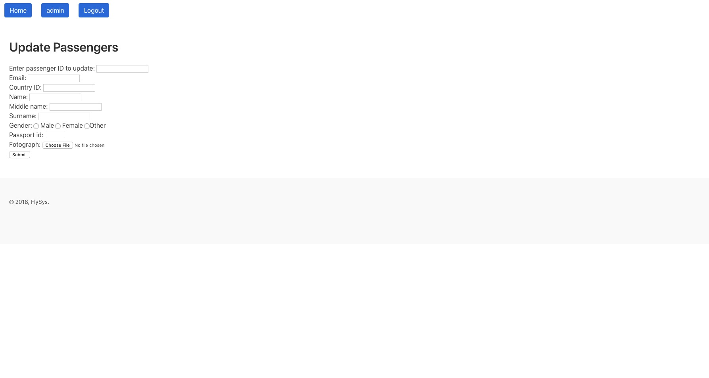

Update a passenger. Admin fills out what is needed to change in the Passenger table. 

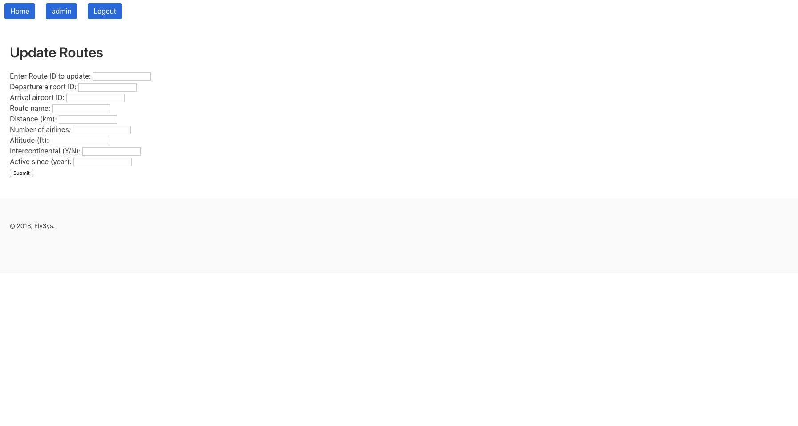

Update a route. Admin fills out what is needed to change in the Routes table. 

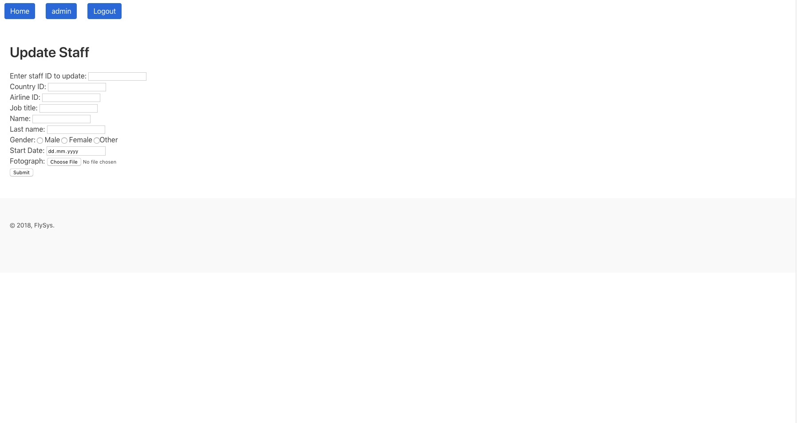

Update a staff. Admin fills out what is needed to change in the Staff table. 

Option 4: View
--------

Here, website shows the rows of the table that has been chosen. 

These are the aircrafts in the database.

These are the aircrafts in the database.

.. figure:: photos/admin/delete/update_flight.jpg

These are the flights in the database.

These are the passengers in the database. First 2 are the members Bulut and Ahmed.

These are the routes in the database. 

These are the staff in the database. 

Option 5: SQL Query
--------

This option is designed for complicated sql queries that admin would like to apply and cannot do with previous options.

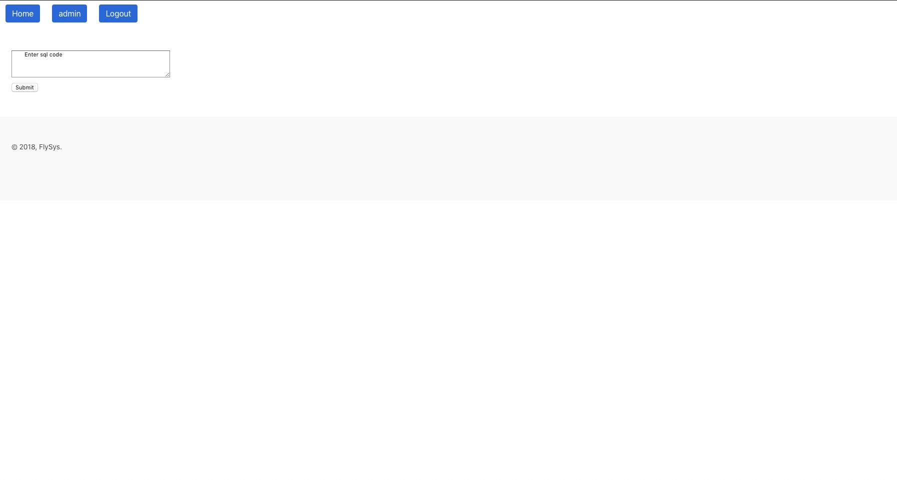

This box is where admin enters the query. 

Let's see an example. 

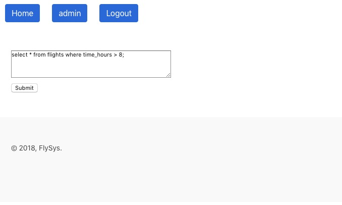

We try to view flights that take more than 8 hours.

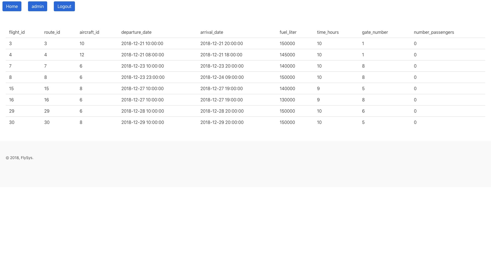

These are the flights that are very tiring to fly in the economy class.

